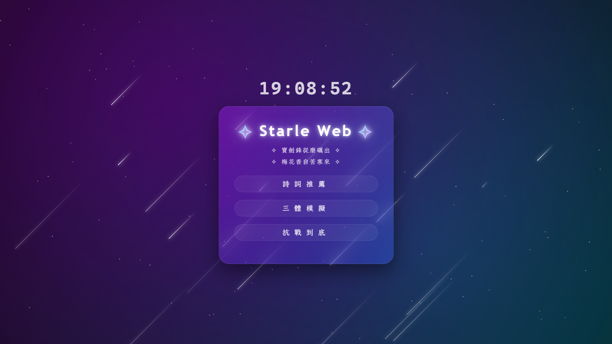

# Starle Web

個人作品集網站，以純 HTML / CSS / JS 建構

**網站連結**：[jialachang.github.io](https://jialachang.github.io/)

<p align="center">
  
  
</p>

## 專案結構

```
StarleWeb/
├── index.html              ← 網站入口
├── docs/                   ← README 截圖
└── src/
    ├── index/              ← 主頁
    │   ├── index.js
    │   ├── main.js
    │   ├── index.css
    │   ├── main.css
    │   └── about.css
    ├── threebody/          ← 三體模擬器
    │   ├── threebody.html
    │   ├── threebody.js
    │   ├── threebody.css
    │   └── solutions.js
    ├── poem/               ← 詩詞推薦頁
    │   ├── poem.html
    │   ├── poem.js
    │   └── poem.css
    └── resistance/         ← 抗戰到底・一九三七
        ├── resistance.html
        ├── resistance.ts
        ├── mapdata.ts
        └── resistance.css
```

## 外部依賴

所有依賴皆透過 CDN 載入，無需本地安裝：

| 依賴 | 用途 |
|------|------|
| Three.js r160 | 三體模擬器 3D 渲染 |
| Google Fonts — Montserrat | 主頁英文字型 |
| Google Fonts — LXGW WenKai Mono TC | 主頁中文字型 |
| Google Fonts — Noto Serif TC | 詩詞頁、抗戰頁中文字型 |

## 本地預覽

三體模擬器使用 ES6 模組，需透過 HTTP 伺服器開啟（直接點開 `threebody.html` 會因瀏覽器安全限制無法載入）：

```bash
python3 -m http.server 8080
# or
npx serve .
```